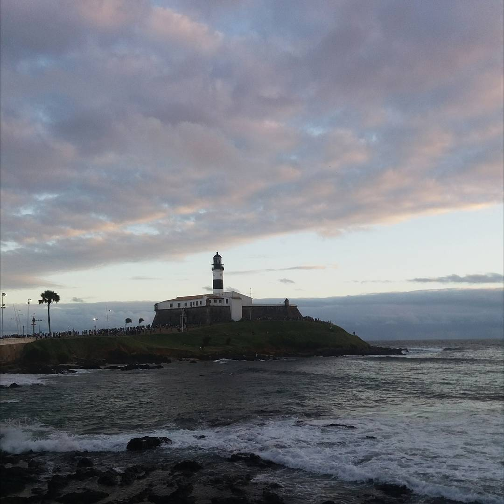
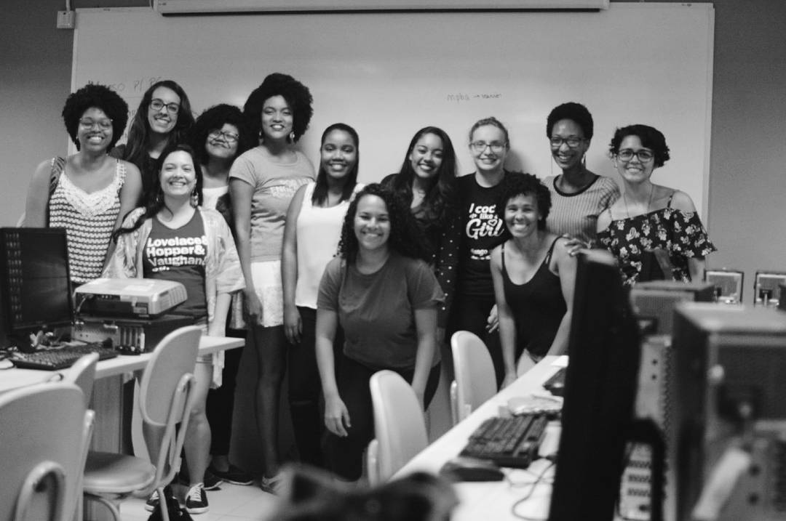
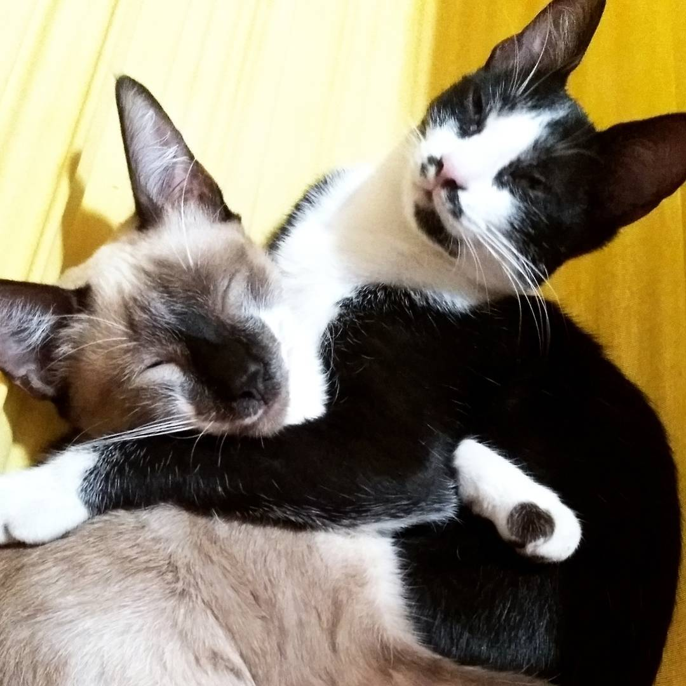
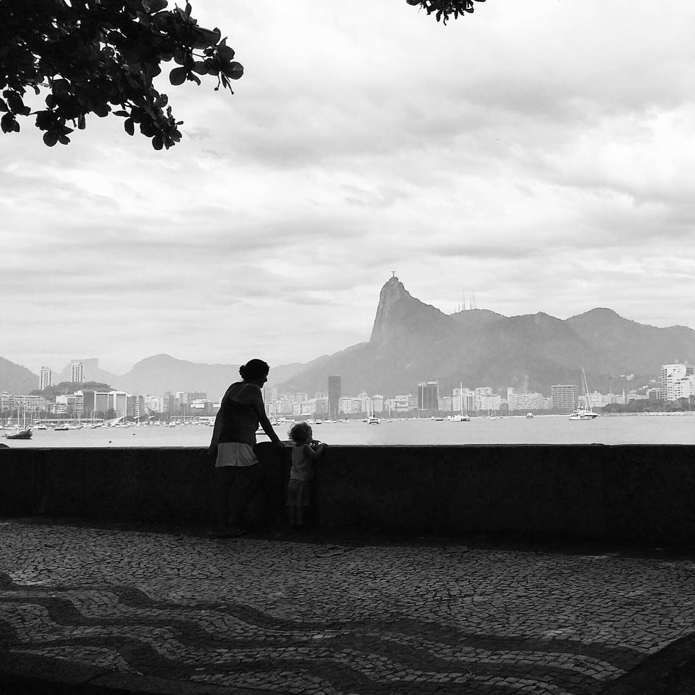

Fazem exatamente dez meses e dezoito dias que eu saí da casa dos meus pais no interior de Pernambuco, deixando três gatos com a minha mãe e toda uma vida em lembranças para trás. Fui ver como era a vida na capital baiana.

Como boa jovem do interior na cidade grande, lembro de ter sentido um misto de encantamento com estranheza quando coloquei os pés em Salvador e vi toda aquela confusão de trânsito, prédios e asfalto para todos os lados. É claro que nessa época eu já conhecia algumas cidades até maiores, mas dessa vez a minha surpresa era diferente, ela vinha com o gostinho de dessa vez não estou só de passagem e tenho que acostumar e entender como as coisas funcionam.

Foram nove longas horas de viagem, desci do ônibus com um colchão, duas ou três malas e um coração curioso palpitando de energia. Minha roomate chegou, pegamos um uber juntas e lembro que a primeira coisa que ela disse foi: bem vinda ao caos. 

As pessoas me perguntavam o que eu tinha ido fazer por lá, e eu tinha que ensaiar com cuidado uma resposta simples, mas toda vez que eu tentava saia alguma coisa diferente, isso porque eu tive mesmo vários motivos para ter tomado essa decisão. Hoje eu consigo dizer que eu fui por ter um imenso desejo em aprender a ter uma vida diferente mesmo. Viver sozinha, num lugar bem longe, passar uns perrengues, aprender com eles. 

(Salvador, agosto 2017)

De cara o estranhamento foi imenso. Eu levei algum tempo para perder o medo de sair de casa sozinha e entender o que era perigoso e o que não era. Desci em ponto errado várias vezes até aprender a pegar ônibus direito. Passei raiva em banco. Me perdi em alguns lugares. 

Mas também aproveitei muito o ventinho da Bahia, comi muito acarajé e entendi as razões pelas quais as pessoas são tão apaixonadas em passar as férias lá. 

Salvador é lindo, tem um povo forte, guerreiro, e muito acolhedor. Tem uma [mulherada](https://www.facebook.com/OxenTIMenina/) incrível promovendo ações que inspiram e unem mulheres na tecnologia. O Rio Vermelho é aquilo tudo mesmo. O acarajé da Dinha deveria estar incluído em todos os mapas turísticos da cidade. Mas gente, o melhor da Bahia são mesmo as pessoas, a conversa é gostosa, e no geral é um povo muito gentil. Era tanta empolgação de uma vez só que não havia nem muito espaço para ter medo e querer voltar.

(Salvador, novembro 2017)

Quando eu disse que ia sair de Pernambuco um primo disse que eu ia chorar, querer ir para casa e desistir dessa ideia no primeiro mês. Ele estava muito errado, a saudade apertou sim, e apertou dum jeito que quando fui visita-los eu quase que não sai de casa de jeito nenhum. Só queria saber de aproveitar a companhia da minha família, comer a comida da minha mãe, mimar e ouvir os ronronados dos gatinhos. O quentinho tava bom e o coração queria ficar, mas intuitivamente alguma coisa sempre me dizia que o meu destino não estava mais ali.

(Tacaratu, janeiro 2017)

Agora estou no estado do Rio de Janeiro. Eu já conhecia o Rio, e sabia em coração que em algum momento me mudaria para cá. Não sei se mais por desejo ou saber que faz parte do meu destino, talvez as duas coisas, mas eu sabia. E sabendo disso só vim mesmo. 

Reservei a minha passagem para nove de fevereiro de dois mil e dezoito. Segundo a astrologia, em meu pleno inferno astral. Estamos vivendo em uma época em que o estado está enfrentando um dos seus períodos de crise mais complicados da história. São mesmo tempos difíceis. Mas para mim o Rio continua lindo.

(Rio de Janeiro, dezembro 2016)

Do Galeão, dessa vez somente com duas malas vim para São Gonçalo. Se você não conhece o RJ, entenda que basicamente eu não estou dentro da capital carioca, estou em uma cidade charmosinha onde nascem coisas muito bonitas, e que fica do outro lado da ponte.

Mudar de casa é um grande exercício de desapego. Você vai entendendo as coisas que realmente importam quando se vê na necessidade de levar com você só o prioritário.

> Necessário, somente o necessário, o extraordinário é demais.

A minha mudança inteira coube em duas malas, sendo que uma delas não encheu nem a metade direito, eu nem paguei aquela famosa taxa para despachar a bagagem, não precisei. Uma amiga brincou que essa seria a bagagem dela para passar duas semanas viajando. A verdade é que eu não acumulo coisas, então isso para mim não foi um grande desafio. Mas para além do não levar coisas, eu posso dizer que aprendi muito sobre prioridades.

A gente muda muito. Aprende a valorizar mais os bons momentos com os amigos e entende que o valor daquela pizza com os amigos nunca foi a pizza. Entende que a companhia da nossa família vale muito mais do que aquela discussão boba sobre quem não arrumou a cama e aquele leve o guarda-chuvas significa mais do que apenas não se molhar.

<iframe width="560" height="315" src="https://www.youtube.com/embed/S4J70C36RGU" frameborder="0" allow="autoplay; encrypted-media" allowfullscreen></iframe>
