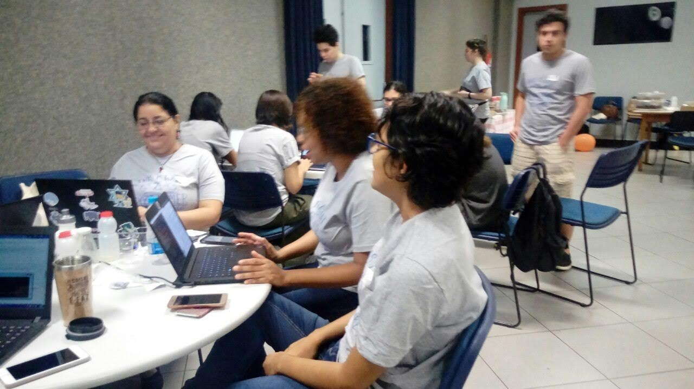
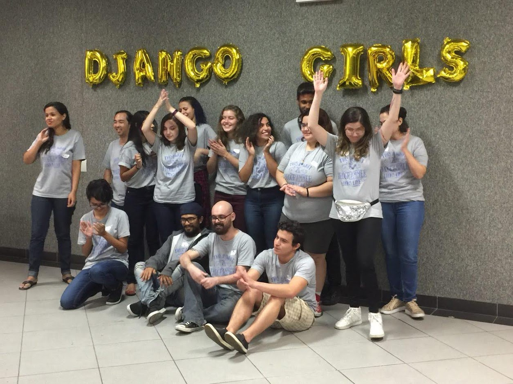

O Django Girls é uma organização sem fins lucrativos, que promove eventos com oficinas gratuitas de programação, em que pesssoas se unem com o objetivo de proporcionar encontros onde mulheres possam ter sua primeira experiência com tecnologia.

Os eventos acontecem em diversos lugares do mundo, aproximadamente em 91 países, e em 416 cidades. Durante o evento, cada participante aprende a criar sua primiera aplicação web usando HTML, CSS, Python e Django.

Se você quiser conhecer mais sobre a iniciativa, conferir se na sua cidade tem algum acontecendo, ou saber mais informações sobre como criar um onde você mora você pode visitar o site da organização [djangogirls.org](https://djangogirls.org/events/)

## Meu primeiro Django Girls

Essa semana eu participei da edição que acontece em Niterói e foi a minha primeira vez no evento. Eu já conhecia a iniciativa há algum tempo mas nunca tinha tido a oportunidade de participar.

Decidi contar como foi a minha experiência para encorajar mais pessoas a também participarem dela. Não tenho como descrever a sensação de gratidão que senti quando pisei naquele espaço, pois foi através de iniciativas como essa que eu entendi que poderia me tornar uma boa desenvolvedora.

Tudo foi incrível! A organização foi impecável, toda a equipe muito gentil e dedicada. As participantes estavam energizadas em grande entusiasmo. Foi um dia inteiro de muito aprendizado, empatia, e conexões genuínas.

## Não é apenas sobre código

Desde a barca, indo para Niterói, eu dei a sorte de conseguir conhecer algumas participantes e conhecer um pouco sobre suas histórias e expectativas com o evento.

Conheci a Ana, uma mulher já mais madura, que já faz parte da área de tecnologia da informação mas quer aprender mais sobre desenvolvimento. Viemos comentando sobre como foi sermos as únicas mulheres nas turmas dentro dos cursos de TI, e como é sempre desconfortável continuarmos sendo as únicas na sala. 

Segundo Ana, na sua época de faculdade as mulheres não eram incentivadas a seguir na carreira como programadoras, e ela sente que a nossa geração está conseguindo mudar essa realidade.

Programar é legal. Mas conhecer essas pessoas é também criar redes de apoio e encorajamento. São conexões que sempre prevalecem além do código, e que precisamos continuar criando para que mais meninas possam crescer sabendo que podem sonhar seus próprios sonhos, e estarem onde quiserem.

## Como foi ser treinadora

Quando eu vi o anúncio, eu quis muito me inscrever no evento, mas não queria me inscrever como participante para não tomar a vaga de alguém que estava iniciando, então decidi me inscrever como treinadora.

Eu confesso que estava um pouco apreensiva um dia antes do evento. Essa foi a minha primeira particapação nele, então eu não conhecia bem o formato de como ele funciona, e além disso, eu também não sabia Django, mas já tinha tido experiência ensinando e programando em Python, além disso o Django é um framework para criar aplicações web, e eu também tinha experiência com web, então eu pensei que tudo bem ir mesmo assim.

E não é que eu estava certa?

É claro que na semana do evento eu fiz um teste usando o framework para ver se conseguia entender minimamente sobre ele para ter mais segurança, e também li novamente o [tutorial](https://tutorial.djangogirls.org/pt/) depois de saber que usaríamos ele de apoio.

Uma impressão que ficou comigo ao final do evento foi que a nossa responsabilidade enquanto treinadora acaba sendo muito mais sobre ser paciente e gentil na interação com as participantes.

Passar tranquilidade quando elas se deparam com os problemas comuns de quem está começando a conhecer sobre as ferramentas, para que elas sintam que estão indo bem é algo muito importante.

## Conclusão

Acompanhar as participantes acabou sendo muito tranquilo, o material de apoio é bem explicado, e toda a equipe de treinadores se apoia muito.

Se você também quiser apoiar o evento e participar de alguma forma, eu gostaria de te dizer que você deveria topar o desafio e se inscrever. Eu participarei de novo de outras edições, com certeza, pois essa foi uma experiência incrível.

(a minha expressão corporal nesssa foto diz tudo)
