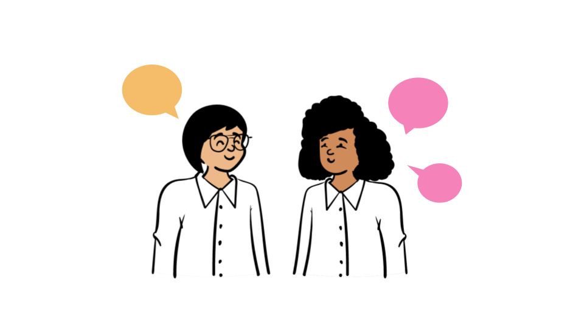
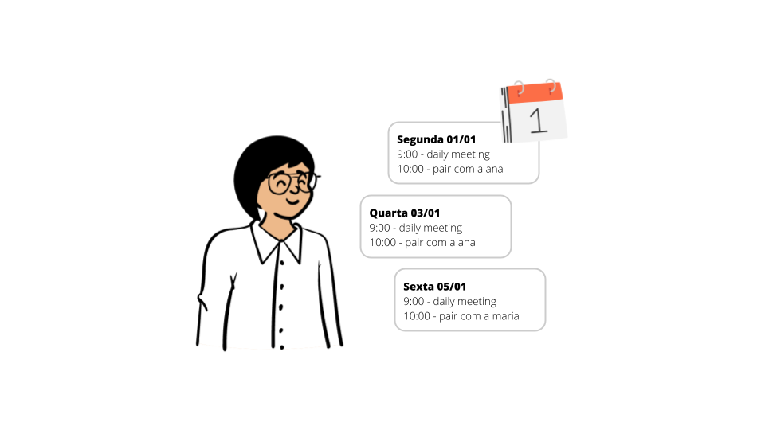
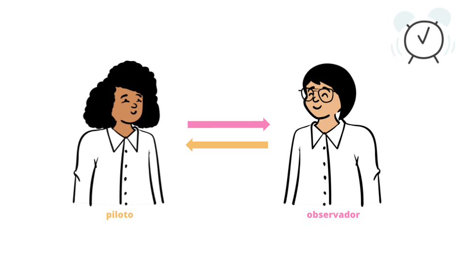
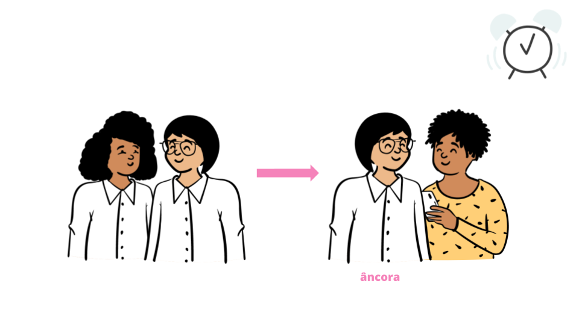

## De onde isso vem

As pessoas sempre trabalharam em colaboração, em algum nível, e isso sempre foi importante para nos fazer avançar enquanto sociedade. 

Colaboração também é um dos princípios mais importantes defendidos pelo movimento ágil, e isso é visto através de diversas práticas. Em 1999, Kent Beck citou especificamente sobre o pair programming.

## Benefícios

- trocas de conhecimento técnico - e de domínio
- trocas de feedback contínuo
- integração entre as pessoas
- soft-skills como comunicação clara, empatia, humildade
- qualidade nas entregas
- revisão de código
- soluções técnicas mais adequadas

## Para fazer acontecer

- Reserve um momento para incluir os pareamentos que você pretende fazer durante a sprint - pode ser logo depois da planning
- Adicione a sua lista de pareamentos na sua agenda
- Ambos precisam estar comprometidos com o planejamento e com o momento prático do pareamento

## Antes de sair codando

- Entendimento do problema: o que cada um entendeu sobre a história?
- Discussão/planejamento sobre uma possível solução

## Entendendo os papéis

### Piloto
- De fato coda a solução e toca no teclado
- Pensa de forma mais prática sobre o que precisa ser feito
- Enquanto coda vai explicando o que está fazendo
- Deve ter o direito de errar

### Observador
- Pensa de forma menos tática, não foca nos detalhes do que está sendo feito na hora. Não toca no teclado
- Fica atento aos obstáculos e possíveis ideias de mudanças que podem surgir, sem interromper o piloto
- Se o piloto não estiver comentando, ou falando rápido demais, ou ainda, se algo simplesmente não ficou claro, o observador deve intervir
- Precisa manter a mente aberta

### Trocando os papéis
Depois de algum tempo, que deve ser definido pela própria dupla, as pessoas precisam trocar de papel, o piloto vira observador, e vice-versa.

Também é uma boa prática parear com mais pessoas. Quando isso acontece em uma mesma parte de uma aplicação, uma das pessoas saem do par e outra pessoa é convidada. A pessoa que já conhecia bem essa parte e que ficou é chamada de âncora.

## Referências
- https://agilemanifesto.org/
- https://martinfowler.com/articles/on-pair-programming.html
- https://madeintandem.com/blog/2015-1-pairing-with-junior-developers/
- https://twitter.com/sarahmei/status/991003128815271936
- https://speakerdeck.com/birgitta410/to-pair-or-not-to-pair-b112241e-155a-4028-93c4-54647e552231
- https://collaboration.csc.ncsu.edu/laurie/Papers/dissertation.pdf

