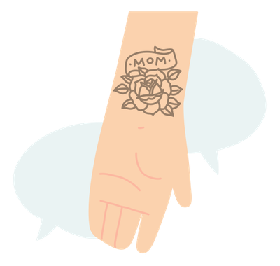
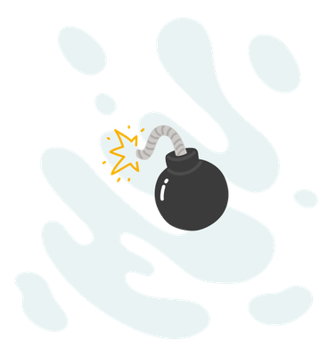
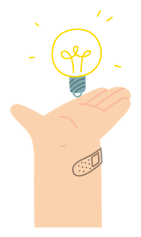

Não pretendo ser sua <strong>desenvolvedora star, unicórnio, ninja, ou qualquer outro apelido comum no hype</strong> das startups. Mas eu posso ser sua desenvolvedora, uma boa desenvolvedora, inclusive. Tenho também estado em posições de liderança nos times em que eu trabalhei nos últimos anos e dessa forma venho assumindo grandes responsabilidades, como a posição sugere.

Quando eu comecei a minha carreira como desenvolvedora, como boa ansiosa, eu tinha grandes expectativas e ambições, e tinha certeza de que <strong>se eu não fosse uma das melhores desenvolvedoras do Brasil eu não encontraria felicidade na minha carreira.</strong> O tempo passou, e isso me levou por um longo caminho de frustrações pessoais que me fizeram tomar muitas decisões ruins, mas não é disso que eu pretendo falar agora. Depois de alguns anos, e muita terapia, eu finalmente aceitei que eu não preciso ser tão f*da.

<strong>Eu desisti de tentar ser uma heroína.</strong> E espero nunca mais desejar ser, principalmente porque isso não é bom para mim enquanto pessoa, e menos ainda para as organizações em que faço parte.

## Os heróis nos times de TI

Esses heróis, são conhecidos como pessoas que são muito boas no que fazem, assumem muitas responsabilidades importantes nas organizações, e que muitas vezes, são pessoas que estão sempre ocupadas. São aquelas pessoas que você sabe que vai precisar delas em algum momento.

Por isso, mas não só, esses profissionais acabam retendo muito conhecimento importante sobre sua área de atuação, e talvez por estarem sempre ocupadas, ou muitas vezes também por estarem acomodadas em sua posição de persona heróica, costumam se tornar profissionais <strong>centralizadores de informações, responsabilidades, e habilidades técnicas.</strong>

A nossa indústria é cheia deles, principalmente porque é uma área muito nova em relação a outras, e temos um gap muito grande de profissionais em um mercado que não para de crescer.

Em um cenário como esse, não é incomum que muitos de nós passemos a sentir que somos, ou que precisamos ser especiais para pertencer a esse mercado, e esse é um sentimento que acaba sendo muito incentivado dentro das organizações.

## Estamos perdendo a oportunidade de desenvolver novas lideranças

Esses heróis geralmente precisam apoiar um ou mais times, e as demais pessoas desses times que precisam trabalhar com eles estão sempre sentindo que não conseguem conquistar sua própria autonomia, ou atingir seu maior potencial no trabalho, pois estão sempre presas a algo que só eles sabem como fazer, e perdendo assim muitas oportunidades de desenvolvimento profissional.

Infelizmente, <strong>na vida real não existem heróis</strong>, existem seres humanos, que podem enfrentar muitas adversidades durante a vida. E quando um herói precisa se afastar de um projeto ou organização ele deixará seu time órfão de um novo herói, que não terá a quem procurar para descobrir tudo o que ele precisa saber sobre o novo mundo o qual ele precisará salvar. 

Na cultura da espera por heróis, estamos disperdiçando oportunidades de desenvolver novos talentos, que poderiam surgir como líderes naturais se pudessem encontrar esse espaço.

