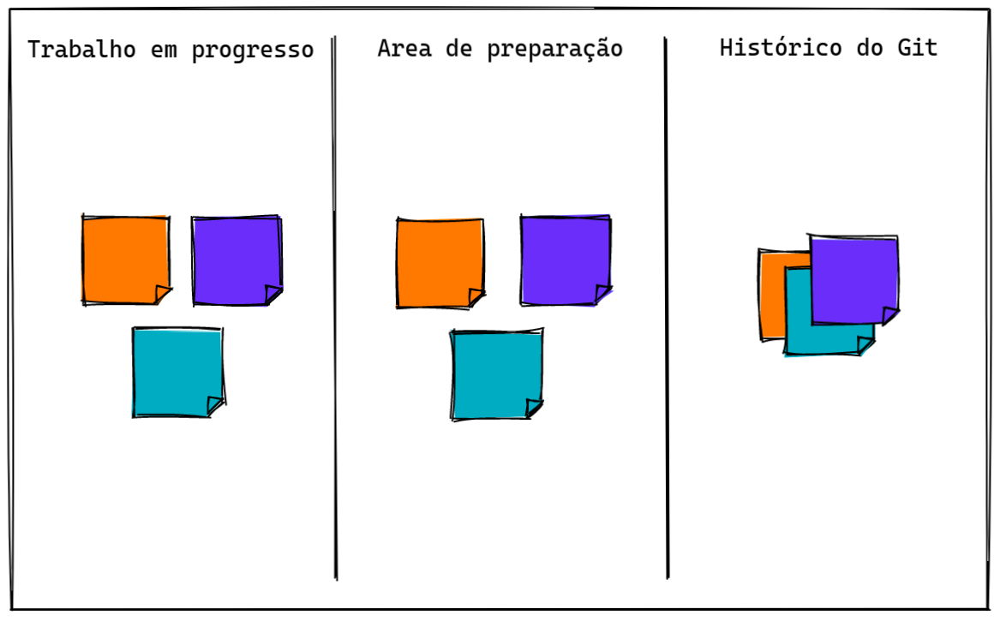
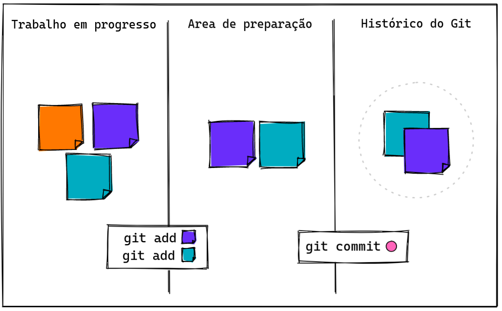
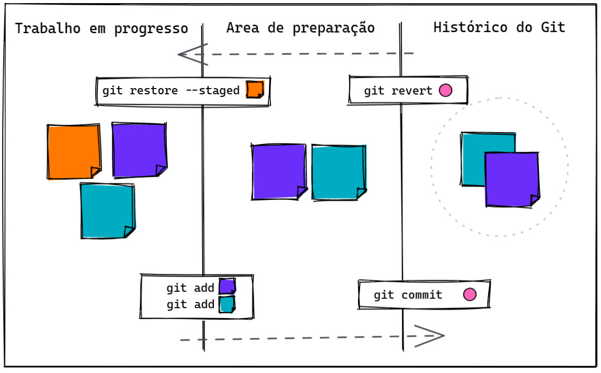
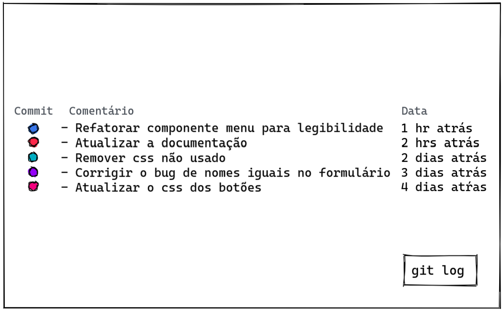
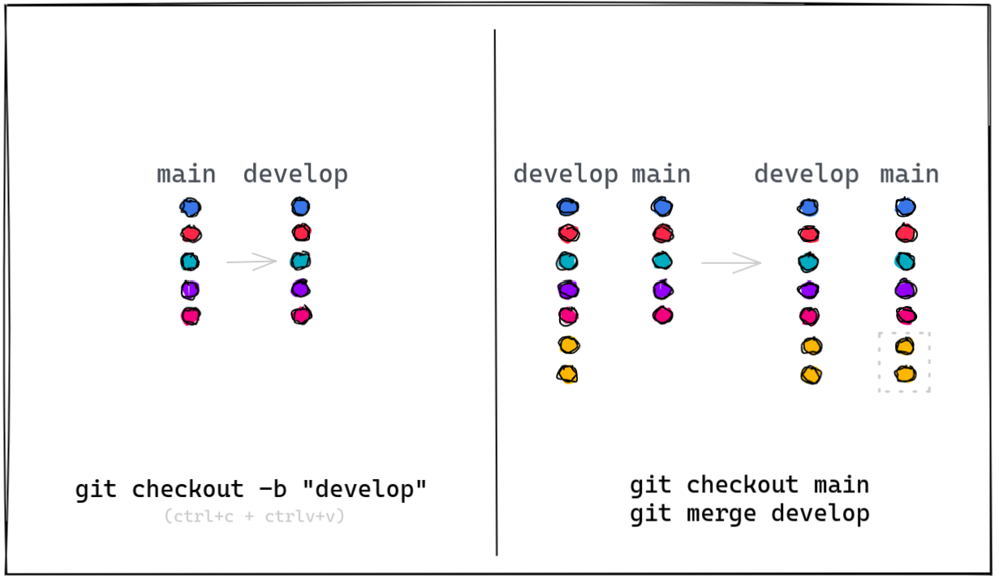
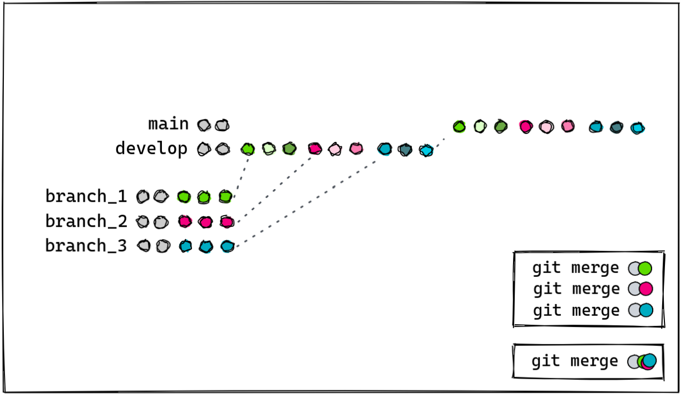

Git é a ferramenta mais famosa do planeta para versionamento de código. É ela quem nos ajuda a lidar com as modificações de arquivos de uma maneira simples e nos auxilia a trabalhar colaborativamente em times distribuídos em diferentes lugares do mundo.

## Entendendo o fluxo

A ideia é dividir o nosso trabalho em pequenos pacotes de mudanças para guardar no histórico.

-  **Trabalho em progresso**: O primeiro passo, é o trabalho feito em si. São todas as mudanças nos arquivos que estamos fazendo. Esse é um dos nossos maiores desafios. Quebrar o nosso trabalho de forma adequada é uma das habilidades mais importantes que podemos desenvolver.

- **Area de preparação**: É o passo em que selecionamos quais mudanças farão parte do pacote que vamos criar.

- **Histórico do Git**: O pacote finalmente vai ser listado como uma unidade no histórico, chamamos essa unidade de commit.

## Boas descrições contam histórias

Tão importante quanto selecionar de forma adequada os pequenos pacotes, é adicionar comentários claros que <strong>descrevam o que cada pacote representa</strong>. Algumas recomendações:

- Iniciar a mensagem usando letra maiúscula;
- Usar o modo verbal imperativo (aquele que indica instruções); 
- Iniciar a frase usando verbos que fazem sentido;
- Evitar mensagens muito longas ou curtas demais;
- Uma forma de testar se uma mensagem está bem escrita, é adicionar a frase: **"Se aplicado, esse commit irá"**. Se a frase completa fizer sentido, e descrever adequadamente o conteúdo adicionado, você escreveu uma boa mensagem;
- Alguns times também preferem commitar usando o inglês, assim como o código que escrevem.

Alguns exemplos ruins:

- _Se aplicado, esse commit irá:_ novas Docs
- _Se aplicado, esse commit irá:_ Update da biblioteca de estilização
- _Se aplicado, esse commit irá:_ Mudou fontes
- _Se aplicado, esse commit irá:_ limpando o código
- _Se aplicado, esse commit irá:_ Atualizações dos botões
- _Se aplicado, esse commit irá:_ botões corrigidos

Uma sugestão de mudança dos mesmos exemplos:

- _Se aplicado, esse commit irá:_ Adicionar a documentação dos novos endpoints
- _Se aplicado, esse commit irá:_ Atualizar a biblioteca de estilização
- _Se aplicado, esse commit irá:_ Atualizar as fontes dos textos
- _Se aplicado, esse commit irá:_ Remover código não usado
- _Se aplicado, esse commit irá:_ Atualizar o conteúdo dos botões
- _Se aplicado, esse commit irá:_ Corrigir o comportamento dos botões de confirmação

<!-- > "Naming is an exercise in dominion. It is power, and it is an act of conjuring too." - Stephen Jenkinson -->

## Trabalhando com Branchs

git reset --hard HEAD^
git revert