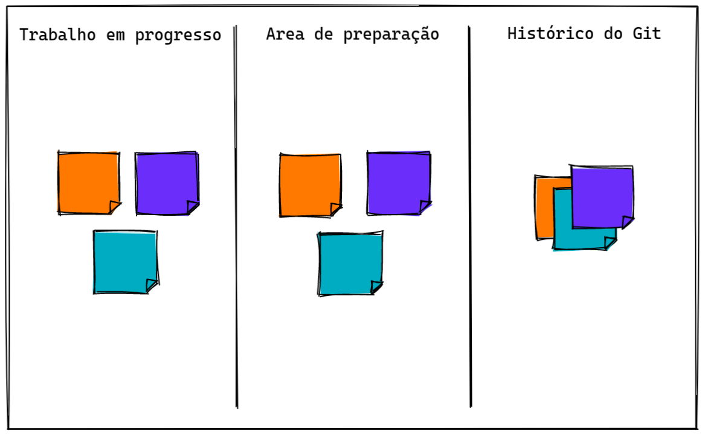
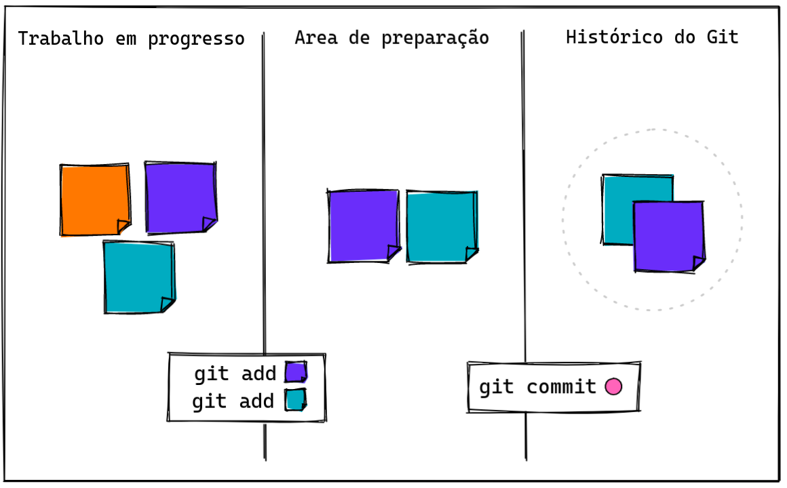
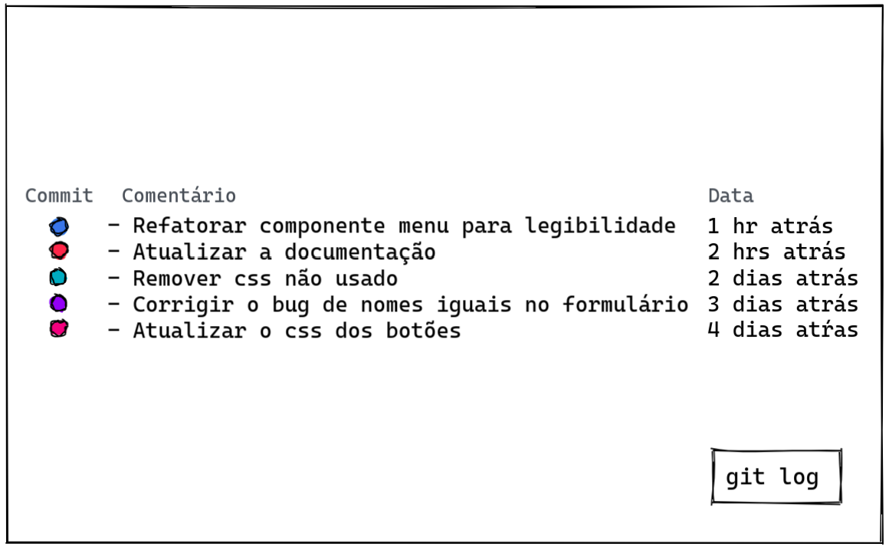

Git é a ferramenta mais famosa do planeta para versionamento de código. É ela quem nos ajuda a lidar com as modificações de arquivos de uma maneira simples e nos auxilia a trabalhar colaborativamente em times distribuídos em diferentes lugares do mundo.

## Entendendo o fluxo


A ideia é dividir o nosso trabalho em pequenos pacotes de mudanças para guardar no histórico.

-  **Trabalho em progresso**: O primeiro passo, é o trabalho feito em si. São todas as mudanças nos arquivos que estamos fazendo. Esse é um dos nossos maiores desafios. Quebrar o nosso trabalho de forma adequada é uma das habilidades mais importantes que podemos desenvolver.

- **Area de preparação**: É o passo em que selecionamos quais mudanças farão parte do pacote que vamos criar.

- **Histórico do Git**: O pacote finalmente vai ser listado como uma unidade no histórico, chamamos essa unidade de commit.

## Como fazer bons commits



### Um commit representa uma mudança

Seja alterando algumas poucas linhas de código em um arquivo, ou em vários arquivos diferentes. Tenha em mente que **um commit pode ser acessado e se necessário revertido no futuro**, e fazer isso deveria ser simples. Esse lembrete vai te ajudar a pensar o você deveria incluir em um commit.

### Diff é o seu melhor amigo

Antes de commitar, reveja o que você pretende commitar. O diff vai listar todas as alterações que você fez, e esse é um ótimo momento para avaliar se o que você fez faz sentido, ou ainda se você pode ter esquecido de apagar algo como um console.log no código, por exemplo. (quem nunca? rs)

```bash
git diff
```

### Um commit não deveria ser tão grande quanto um dia inteiro de trabalho

E a razão disso é simples, imagine que você levou horas fazendo um trabalho, mas na hora de salvar, por um descuido você acabou perdendo tudo o que você fez, e você precisou começar ele novamente do zero, agora com menos tempo. Parece trágico, mas isso já aconteceu comigo.

Um outro exemplo muito comum: Imagine que você passou horas desenvolvendo um componente para o fluxo de login de um usuário, você dedicou seu tempo ajustando toda a estilização da página, já deixou tudo pronto, e agora precisa começar a integração desse componente com o resto do fluxo. 

Depois de mais algum tempo trabalhando na integração, você percebe que o caminho que você escolheu para desenvolver isso não foi o mais adequado e talvez fosse melhor abandonar a solução para começar de novo essa parte seguindo um novo caminho.

Se você tiver lembrado de commitar a primeira parte que você gastou horas trabalhando, e quiser abandonar somente a parte da integração, fazer isso é simples, basta usar um único comando do git e limpar toda a área de trabalho em progresso. Mas se você não fez isso, se prepare para ter muita dor de cabeça. E o que deveria ser simples se torna uma atividade de muito esforço.

## Boas descrições contam histórias



Tão importante quanto selecionar de forma adequada os pequenos pacotes, é adicionar comentários claros que <strong>descrevam o que cada pacote representa</strong>.

Algumas recomendações:


- Tenha em mente que a frase deve sempre representar o que o commit que você fez representa;
- Inicie a mensagem usando letra maiúscula;
- Inicie a frase usando verbos que fazem sentido;
- Evite mensagens muito longas ou curtas demais;

Alguns exemplos:
```md
Mensagens confusas :(
- novas Docs
- Update da biblioteca de estilização
- Mudou fontes
- limpando o código
- Atualizações dos botões
- botões corrigidos

Se aplicado, esse commit irá... novas Docs
```

```md
Mensagens mais claras :)
- Adicionar a documentação dos novos endpoints
- Atualizar a biblioteca de estilização
- Atualizar as fontes dos textos
- Remover código não usado
- Atualizar o conteúdo dos botões
- Corrigir o comportamento dos botões de confirmação

Se aplicado, esse commit irá... Adicionar a documentação dos novos endpoints
```

<br>

## Formas de usar o Git Log

Depois de **git status**, acho que **git log** é o comando que eu mais uso na vida. Recentemente eu aprendi formas muito legais de usar ele. Esse eu aprendi no blog técnico da **[Julia Evans](http://jvns.ca/blog/2021/01/07/day-33--a-login-bug--a-git-trick--and-generating-yaml-files/)**. 

Eu apelidei ele carinhosamente de "cadê o meu atributo que estava aqui?". Esse comando conta as ocorrências de uma string e relata quando a contagem foi alterada, dessa forma podemos descobrir se a string foi modificada, e como isso foi feito. No meu caso, ele mostou um commit que eu adicionei de um post incluindo o termo.

```bash
git log -S "pair-programming"
```

Exibe os commits que incluem a string na menssagem do commit.

```bash
git log --grep "post"
```

Exibe somente os commits feitos nas última semanas. Esse since aceita [outros formatos também](https://git-scm.com/book/en/v2/Git-Basics-Viewing-the-Commit-History).

```bash
git log --since=2.weeks
```

Exibe os logs de forma menos poluída e pode ser personalizado.

```bash
git log --pretty=format:"%h - %an, %ar : %s"
```


## Referências
- https://chris.beams.io/posts/git-commit/
- https://www.atlassian.com/br/git/tutorials/setting-up-a-repository
- http://jvns.ca/blog/2021/01/07/day-33--a-login-bug--a-git-trick--and-generating-yaml-files/
- https://git-scm.com/docs/git-log